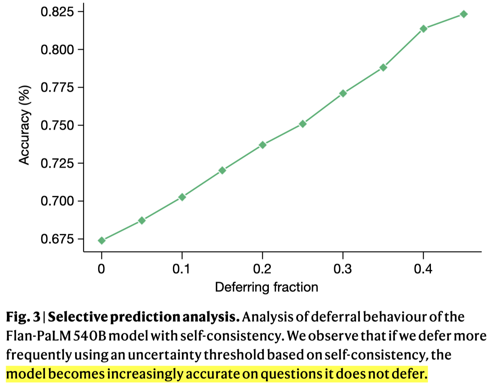
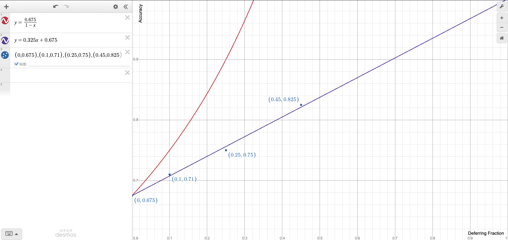

# 13-selective-prediction

Source: google, Large language models encode clinical knowledge, nature, 2023.

**Why 为什么需要做**

* Google 团队在用 LLMs 做医疗问答的时候，发现即使做了 self-consistency 之后，产生的回答仍存在事实性错误
* 因此，作者希望能够设计一种机制，能够在 LLMs 输出不够自信的时候，选择不进行回答（论文中称为 deferral behaviour）

**How 具体要怎么做**

* 首先需要对 LLMs 的输出的“自信程度”（或不确定性程度，uncertainty）做量化
* 作者采用了一种非常直观的方法：计算多次输出结果中与 self-consistency 结果一致的比例，即 $ \frac{\sum_{i\in [N]}\mathbb{1}(p_{i}=p^*)}{N}$，其中 $p_i$ 是第 $i$ 次输出结果，$p^*$是 $N$ 次输出的 self-consistency 结果
  * 在实验中，作者为其 Flan-PaLM 540B 模型设定 $N=41$​
* 之后，对该比例设定阈值，低于阈值时即不回答

**What 做到什么效果**

* 实验表明，随着（阈值的提高）拒绝回答的比例提高，在回答了的问题上的精度逐渐提高，基本呈线性趋势
* 实验结果图：

**Comments**

* 实际上，uncertainty quantification 并不是一个新话题，已经有非常多的相关文献

  * Uncertainty Quantification in Machine Learning for Engineering Design and Health Prognostics: A Tutorial, arxiv, 2023.
  * A Survey on Uncertainty Quantification Methods for Deep Learning, arxiv, 2024.
  * 本文中使用的基于多个结果的一致性的度量思想也是很常见的，例如 ensemble 模型中常用的 majority 分数，以及在 `FoggyCache: Cross-Device Approximate Computation Reuse, mobicom, 2018.` 中，针对 kNN 算法提出的 Homogeneity factor 也采用了类似的思想。
* 关于实验结果，我觉得应该增加两种对比作为参照：

  * 如何衡量 deferring 策略的合理性？并不一定精度上升就说明合理，因为该精度并不是在全部问题上的，而只是在“选择回答”的那些问题上的。这一点和我之前做过的关于输入过滤的研究类似，这里相当于过滤掉一些“困难的、对回答不确定的”输入问题。
  * 从图中看到，大概结果是 x=0 y=0.675，那么一个完美的 deferring 策略（或者称为输入过滤策略）应该是：当过滤 10% 的问题时，希望这些问题都是那些模型没有回答正确的问题，则最优的曲线应为：$y=\frac{0.675}{1-x}$
  * 另外一个参考就是函数 $y=0.325x+0.675$，这应该是接近 random 的过滤效果
  * 这样我们可以得到如下参考图：

  * 可见，论文中 report 出的结果和 random 参考线几乎相同，远差于理想的 deferring 策略。因此，我认为该部分的设计并没有价值。我们需要深入研究更有效的 deferring 策略。
