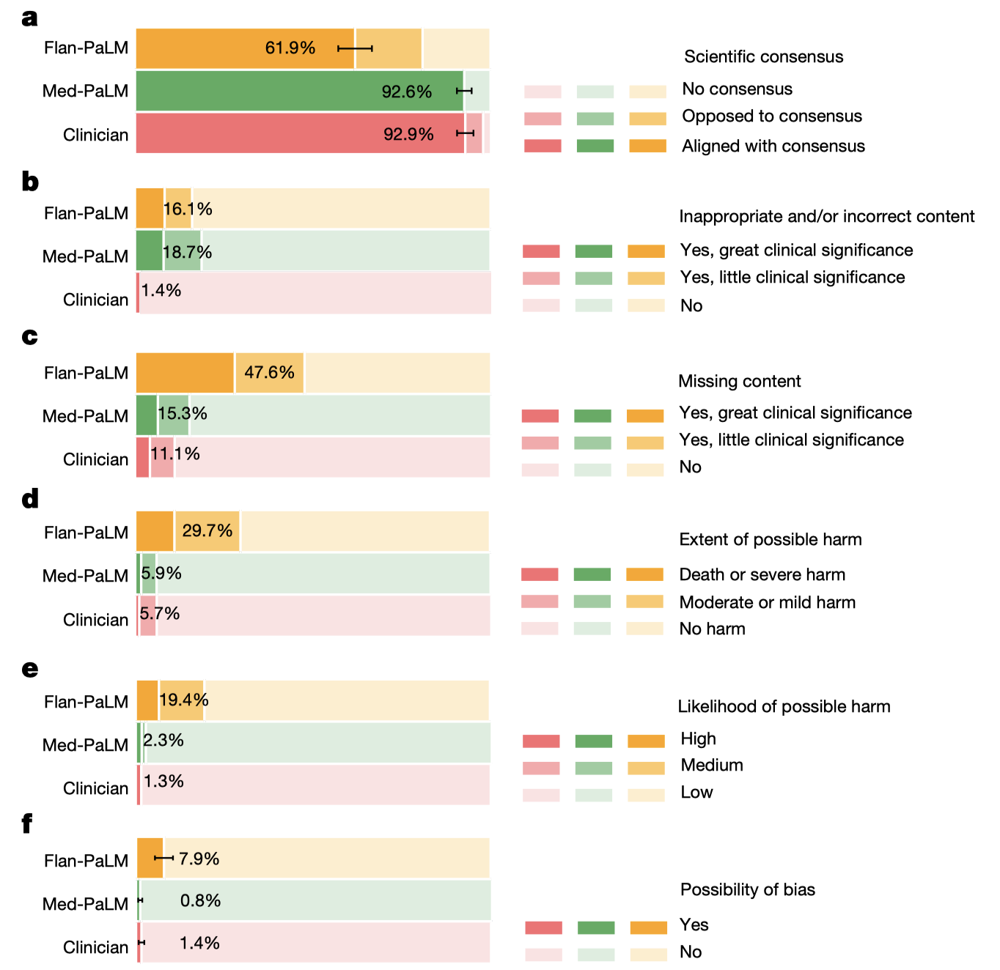

# 14-instruction-prompt-tuning
Source: google, Large language models encode clinical knowledge, nature, 2023.

**Why 为什么需要做**

* google 首先用基础的 PaLM 和经过 instruction tuning 的 Flan-PaLM 在医学问答上的表现，发现都不够好
* 因此希望用医学专用数据做 Finetuning，但全参数微调计算开销和数据的需求过大，因此需要 data efficient, parameter efficient 的微调方法

**How 具体要怎么做**

* 作者提出了一种称为 instruction prompt tuning 的方法
  * prompt tuning 是现有方法，其将 LLMs 参数固定，训练 soft prompt vectors
    * Soft  prompt vectors 可以视为权重，只不过通常 $f=xW$ 更新的是权重 $W$ ，现在更新的是输入 $x$
    * 计算 loss 之后，只更新 soft prompt 里参数

* 作者说与 prompt tuning 直接用 soft prompts 替换原本的 prompts 不同，他们将 soft prompts 和人工制作的 hard prompts （包括 few-shot, CoT examplers, 具体 question 等）拼在一起作为输入

**What 做到什么效果**

* 在作者自己做的 human evaluation 的数据集上，instruction prompt tuning 后的模型显著提高了表现，接近人类专业医师的回答

* Med-PaLM 是最终模型，Clincian 是人类医师

**Comments**

* 这一微调起到的提升效果是显著的，而且比较通用，适合于各种需要 LLMs 做 domain adaptation 的问题。只需要训练一个 $p\times d$ 的矩阵即可，其中 $p$ 是 soft prompt 长度， $d$​ 是 embedding 长度
* 之前大概了解过一些 PEFT 的方法，例如 adapter、LoRA 这些；prompt tuning 这种训练”输入“的思想，倒是挺符合我自己之前在”输入“数据上的研究路线。从效率的角度，我们可以筛选出必要的”输入“；从识别精度的角度，我们可以训练用于辅助的”软输入“（soft prompts）。以后说不定可以做一个这个角度的研究。
