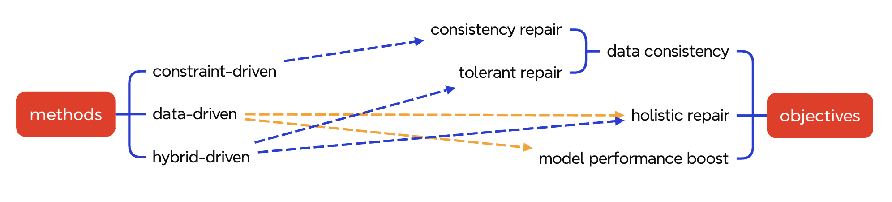
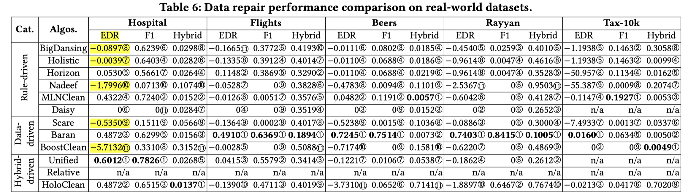
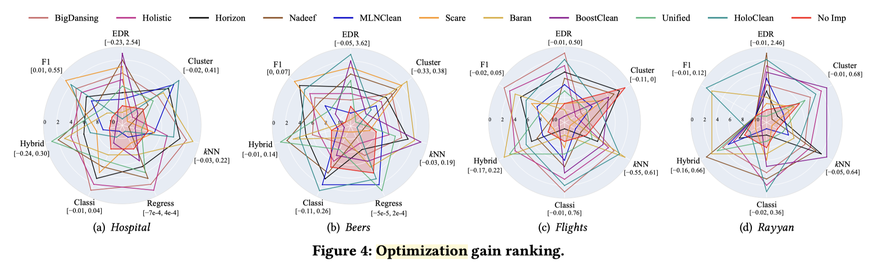

# 18-data-repair
Source: Automatic Data Repair: Are We Ready to Deploy?

**Why 为什么需要做**

* 数据修复，data repair，旨在将数据集合里的错误单元修复为正确值
* 本文作者发现，仅用 data repair 的 precision 和 recall 进行评估是有偏差的，一个例子：
  * 原始数据里有 10 个错误单元，某算法的结果是修复了 100 个单元，其中
    * 80 个修复后的单元值是对的
      * 10 个真正错误的单元被修复正确
      * 70 个并没有错误的单元值被修复为原始值，因此也是正确的

    * 20 个修复后的单元值是错的
      * 20 个并没有错误的单元值被修复为其他值，因此是错误的

  * 如果仅看修复结果，则 precision 为 0.8，recall 为 1.0，结果很好
  * 但如果看得到的最终数据，则数据质量反而下降严重：原本 10 个错误单元变成了 20 个错误单元

* 因此，为了全面地评估 data repair 的结果，需要同时考虑：data repair evaluation 和 downstream model evaluation

**How 具体要怎么做**

* 本文首先将 data repair 方法以及修复目标进行了总结分类：
  * 关于方法分类：
    * constraint 指对于单元值的限制，例如“城市相同则省份相同”，以及“收入更高则缴税更高”
    * Data-driven 则是一些基于统计或机器学习的方法
    * hybrid 则是结合了规则和数据

  * 关于修复目标：
    * consistency repair 指修复后的单元值必须遵循 constraints
    * tolerant repair 指修复后的单元值遵循所谓 modified constraints
      * 这里仅从本文内容我没有能够理解，找到了一篇 sigmod 16 的工作：Constraint-Variance Tolerant Data Repairing，该工作说：开始给定的 constraints 可能是不准确的（具体来讲，分为 oversimplified 和 overrefined）
        * 例如：一个过简单的规则是“相同 Name 则 PhoneNum 相同”，显然没有考虑到同名的情况，这会导致很多原本正确的单元被错误修改
        * 一个过复杂的规则是“相同的 Name 且相同的 Year 且相同的 Birthday 则 PhoneNum 相同”，其中 Year 的约束是不必要的

      * 所以需要对 constraints 做一些 modification，得到类似 “相同 Name 且相同 Birthday 则 PhoneNum 相同” 这样的合理规则
      * 这样就可以理解什么叫 modified constraints

    * holistic repair 旨在最大化消除的错误
    * model performance boost 旨在提高使用数据训练出的模型的性能

* 鉴于单纯使用 precision 和 recall 的有偏评估，文章提出一个新的 metric 称为 Error Drop Rate: $EDR = \frac{dis^{d2c} - dis^{r2c}}{dis^{d2c}}$ ，其中 dis 是距离函数，d2c 指 dirty-to-clean，r2c 指 repaired-to-clean，直观理解，EDR 评价修复操作将原本错误值向正确值靠近的相对程度
* 文章提出一个观点：现有的 data repair 效果不好的原因主要在于对于那些原本是正确的单元的错误修复。
* 因此提出使用一个专用的 error detection 模型，Raha，来让原本正确的单元值不会被修改，进而实现了对这些 repair 方法的优化

**What 做到什么效果**

* 文章的一个非常关键的发现是：很多现有的 data repair 算法实际上损害了数据质量（EDR 为负值）：
  * 我认为这是非常重要的发现，通过对于 metric 的研究，发现了当前验证角度的不合理性，能够起到纠正该方向后续研究的作用

* 在应用了 Raha 进行优化后：
  * 其中浅红色阴影部分 No Imp 表示没有提升，可见大多数方法在使用了该优化后，都在关键指标上提升了性能

**Comments**

* 关于 metric 的研究我觉得是非常关键的，因为定义一个任务，关键就是“输入、输出、输出结果如何评价”
* 这是一种第一性原理思考的方式，即不盲从现有的经验。通过大量的方法调研，经过自己的理解后总结，然后通过理论（关于指标的设计）和实验进行分析。以后的科研上要向这个工作学习。
