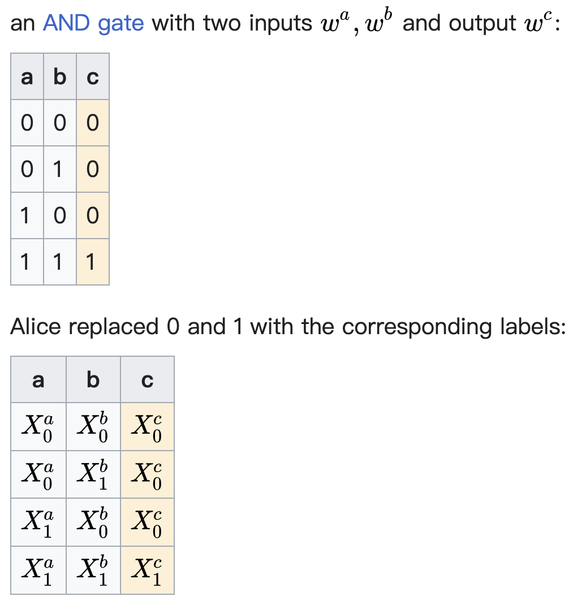

# 29-circuit
Source: outsourcing MPC

> Circuit garbling

* https://en.wikipedia.org/wiki/Garbled_circuit
* 混淆电路，其场景是：两方 Alice & Bob，各有其数据 x1, x2，希望一起计算函数 f(x1, x2) 但互相不能够知道对方的数据信息
* 首先需要把函数 f 表示为一个 boolean circuit，布尔电路其实就是由 XOR 和 AND 门组成的一个两输入 $w_a, w_b$ 的逻辑电路
* Alice 对这个电路的真值表做变换：
  * 为两个输入都分别随机生成两个称为 labels 的 k-bit 数据 $X_0^{a}, X_1^{a}$ 以及 $X_0^{b}, X_1^{b}$ 分别用于替换原本的 $w_a=0,1$ 和 $w_b=0,1$ 的位置
  * 然后通过逻辑电路，正常算出对应的输出，记为 $X^c_{0\ or\  1}$​
  * 
  * 上图是 wiki 里给的一个 AND 电路的例子
  * 再之后，Alice 会对真值表做行的随机 permutation，这也是“混淆” garbling 一词的来源

* 假设 Alice 的数据是 $a_1,a_2,a_3,a_4,a_5$ = 10011
  * Alice 随机为每一位数据，生成两个称为 labels 的 k-bit 数据 $X_0^{a_i}, X_1^{a_i}$​
  * 由此对数据进行加密

* 对于 Bob 的数据，则以 Bob 作为 receiver、Alice 作为 sender 进行 oblivious transfer 来加密，从而保证 Alice 不知道 Bob 的数据信息
* 最后由 Bob 利用其受到的加密后的 Alice 和自己 Bob 的数据，以及混淆后的真值表，做 evaluation，得到输出结果

> Adversary structure

* 用于描述攻击者的属性，例如： $\{(\mathcal{A}_1[m], \mathcal{A}_2[sm], \mathcal{A}_3[nc_1, nc_2])\}$ 表示三个攻击者分别是 malicious、semi-honest、以及 non-cooperating w.r.t. A1 & A2
* 在证明 security 的时候，可以声明证明的 security 是 against 什么 adversary structure

