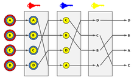

# 31-mix-networks
Source: https://en.wikipedia.org/wiki/Mix_network

> Mix networks

* 最近在思考如何混淆多个 requests 的多轮输出序列问题。从 ChatGPT 的回复中，我看到了这个技术，mix networks
* 混合网络是一种加密协议，旨在增强通信网络中的隐私和匿名性。可以掩盖消息来源，使第三方难以追踪消息或交易的来源
* 目标：将来自不同发件人的消息传递给预期收件人之前，通过混合来自不同发件人的消息来为用户提供匿名性。这阻止了观察者确定谁发送了哪条消息。
  * 在我们的 case 里，收件人就是最后的输出结果，发件人就是 requests，我们希望掩盖的是输出结果和 requests 之间的对应关系

* 流程：
  * 消息混合：用户将消息发送到网络中的一系列节点（称为 mixes）。这些节点中的每一个都会在一定时间内从多个用户那里收集消息。一旦收集了预定义数量的消息，混合节点就对它们进行 shuffle，有效地掩盖了发送者和接收者之间的关系。
  * 加密：消息在通过网络发送之前通常会多次加密（分层加密）。这确保了每个混合节点只能解密外层，允许节点读取消息，但不知道其原始发件人或最终收件人。
    * 这里可以用 wiki 的图理解：
    * 原始信息进行多层加密，每个节点按顺序解密，并传递到下一个节点

  * 转发：混合后，节点将消息转发到下一个节点或最终收件人。链中的每个节点只知道它接收和发送的消息，但不知道它们的来源或最终目的地。

