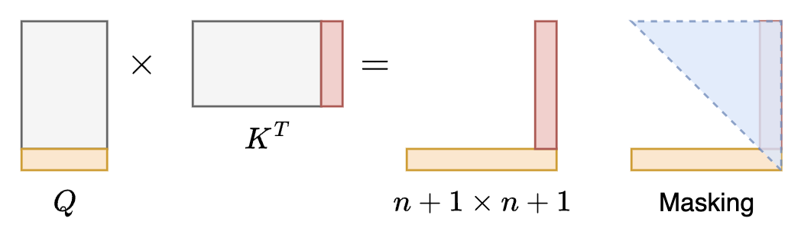
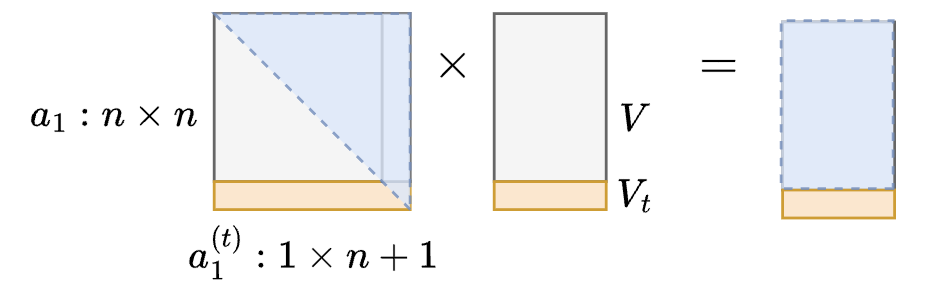

# 1-kvcache
以数学符号以及图示的形式，解释 Transformer decoder 自回归推理过程。

**1. prefill 阶段**

输入数据：$x \in R^{n\times d}$ 其中 n 是 prompt 长度，d 是Embedding 长度

attention：

计算 $Q = xW_q, K=xW_k, V=xW_v$

* $W_q, W_k, W_v \in R^{d\times d}$
* QKV 的 shape 都是 n*d

计算 $a_1=softmax(QK^T/\sqrt{k} + M)$ 这一步的输出结果 shape 是 n*n

计算 $a_2 = a_1V$​ 得到 n*d 的输出

计算 $a_3 = a_2W_o$  得到 n*d 的输出

计算 $a_4=LN(a_3+x)$ 得到 n*d 的输出

feedforward：

计算 $y=ReLU(a_4 W_1)W_2$ 得到 n*d 的输出，进入下一个 Transformer layer

**2. auto-regressive generation 阶段**

输入数据：$t \in R^{1\times d}$​ 是新生成的一个 token 的 Embedding

我们用 $[x,t] \in R^{(n+1)\times d}$ 表示将 x 和 t 拼接后的 Embedding

attention：

不需要重新计算 $[x,t]W_q$ 因为：$[x,t]W_q = [xW_q, tW_q]$ 即只需要新计算 $tW_q$ 之后再和原本计算过的 $xW_q$ 拼接，就可以得到新的结果

所以这里只需要计算 $Q_t = tW_q, K_t = tW_k, V_t = tW_v$ 得到 1*d 的输出

接下来是 kv-cache 里的 *k-cache*：

如果为了计算完整的、新的 $QK^T$ 我们其实需要完整的 Q 和 K，如下图所示：

因为有新的 $Q_t$ 所以旧的 K 需要拿出来，新的一行（橙色）与 K 计算之后，得到最后一行新的橙色结果

因为有新的 $K_t$ 所以旧的 Q 也需要拿出来，和新的红色的那一列进行计算，得到后面新的红色一列

但是在 decoder 中，我们会对结果进行 masking，新的红色一列是不需要的，所以，实际上我们只需要把旧的 K 进行缓存，计算的时候取出即可：

这就是 k-cache 即为了计算新的一行，需要把之前计算过的灰色的 K 进行缓存。

下面介绍 v-cache：

计算 softmax 得到 1*(n+1) 的输出 $a_1^{(t)}$

之后 $a_1^{(t)}$ 和 $[V,V_t]$ 进行相乘，如下图所示：

但由于 $a_1$ 的右上角都被 masking 为 0 了，所以实际上计算出的结果只有最后一行是新的，也就是说，之前的 n*n 的 attention 结果并不需要，在这一步只需要把旧的 V 缓存拿出来就行：

得到新的 $a_2^{(t)}$ 的 shape 是 1*d

之后并不需要重新计算 $[a_2,a_2^{(t)}] W_o$ ，原理同 QKV 的计算，只需要计算 $a_3^{(t)} = a_2^{(t)} W_o$​ 即可

最后把得到的 $a_3^{(t)}$ 与 $x_t$ 相加后做 LN 即可，由于 LN 是按行计算的，新的结果只需要这两个向量

feedforward 同 QKV 以及 Wo 的计算，都不需要之前的运算结果，只需要用新的一维向量和权重做运算，最终得到下一个 Transformer layer 的输入：$y_t \in R^{1\times d}$

上述介绍可见，在自回归的多轮运算中，对于前面已经完成计算的结果，我们只需要保留 K 和 V 的这两部分即可，其他的中间结果都无需保留。这也是 KV-cache 的名字的原因。
