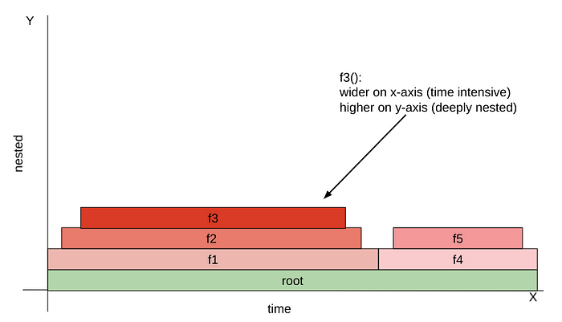

# 18-hm-microkernel
Source: Microkernel Goes General: Performance and Compatibility in the HongMeng Production Microkernel, OSDI 2024. 陈海波老师团队的论文


> Linux ABI

https://en.wikipedia.org/wiki/Application_binary_interface

ABI: Application Binary Interface 是关于两个 binary program modules 之间的接口。ABI定义了如何在机器码中访问数据结构，这是一种低级、依赖硬件的格式。相比之下，API 在源代码中定义访问接口，这是一种相对高级的、独立于硬件的、通常是人类可读的格式。

遵循 ABI 一般是编译器、操作系统或 library 需要考虑的，遵循 API 则是 application 程序需要考虑的。


> POSIX: Portable Operating System Interface

POSIX 定义系统和用户级 API 以及命令行 shell 和实用程序接口，以实现与 Unix （及其变体）操作系统的软件兼容性（可移植性）。


> IPC: Inter-Process Communication

根据 wiki，microkernel 的定义就是最简化的软件，其能够提供一些【机制】来实现操作系统。而这些机制就包括 ：low-level 地址空间管理、线程管理、IPC


> Principle of least privilege

信息安全里的概念，最小特权原则（PoLP）要求在计算环境的特定抽象层中，每个模块（如进程、用户或程序）必须能够只访问其合法目的所需的信息和资源。


> Apple XNU (X is Not Unix) operating system

是一种 hybrid kernel，结合了 microkernel 和 monilithic kernel 的架构

尽管 hybrid kernel 也能最简化 core kernel 的功能，但是并不是 least privileged，因此安全性不如 microkernel


本文写 background 的思路：

* 回顾 microkernel 的优点和发展，提到 SOTA 基本都是针对特定领域的，引出“鲜有工作探索将 microkernel 扩展为通用 OS kernerls”这一局限
* 再谈现有的企业级通用 OS kernerls，比如 Microsoft NT 以及 Apple XNU，都是 hybrid kernel，有其优点，但主要是在安全性上不如 microkernel 架构
* 之后讨论让 microkernel 通用化的三个主要 demands：兼容性、资源管理、性能。进而介绍现有工作提出的各种架构（unikernel, multikernel, exokernel, splitkernel 等），并讨论它们对移动、车载场景的不适用性。
* 最后给出结论：我们相信值得去探索将 microkernel 扩展为通用 OS kernel 这条新途径

紧接着就是用真实测试图来引出几个关键 observations


> CPU flame graph

CPU flame graph（火焰图）是一种可视化工具，用于表示程序的性能，尤其关注 CPU 使用率。

找到一个好理解的例子。对于如下一个程序：

```c
root() {
    f1() {
         //some lines of code goes here
         f2() {
              //some lines of code goes here
              f3() {
                   //some cpu intensive code goes here
              }
         }
    }
    f4() {
        //some lines of code goes here
        f5() {
             //some lines of code goes here
        }
    }
}
```

其 flame graph 如下：



即 x 轴表示函数持续时间，y 轴表示嵌套的调用关系。


> Double bookkeeping

指的是在 memory manager 和 file system 里都分别维护 page cache，因此是 double


如何优化效率：

* RPC-like fastpath： 用于解决资源分配的问题
* 放松 trusted OS services 之间的隔离：用于降低 IPC 开销
* 合并紧耦合的 OS services：用于减少 IPC 的频率
* address tokens：用于实现高效内核对象 co-management，并促进对匿名内存的 policy-free in-kernel paging

