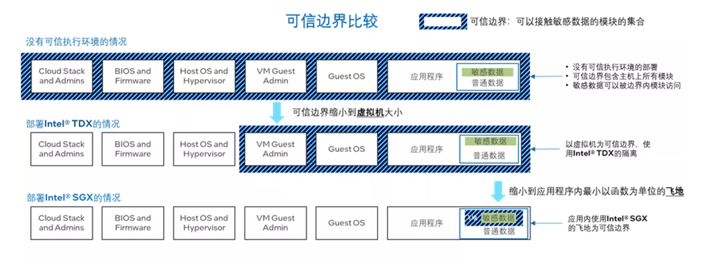

# 4-sgx
Source: https://www.intel.cn/content/www/cn/zh/customer-spotlight/cases/privacy-security-challenge-large-language-model.html

TEE 应用于 LLM 的挑战：资源和性能限制

* 资源限制：TEE 的计算和存储资源有限，LLM 的参数量和计算开销可能会超出一般 TEE 范围
  * 通过 google 搜索得到：Total memory used by all Intel SGX enclaves residing on a single Windows computer is restricted to **less than 128 MB**.
  * 内存还是比较有限的，根据 https://rahulschand.github.io/gpu_poor/ 的计算，70b 的模型，900 tokens 输入，100 tokens 输出，kv-cache 就要 4500 MB，中间变量倒是不大，193 MB
* 英特尔自第三代英特尔 至强 可扩展处理器开始内置英特尔 软件防护扩展（英特尔 SGX）技术，其安全飞地的容量最多可达单颗 CPU 512GB，双路共计 1TB 容量，可满足目前千亿大模型的执行空间需求。
  * 这是很暴力的解决方法，直接扩大安全内存

TDX：Trust Domain Extension 是虚拟机级别的隔离

* 我觉得对于安全推理任务而言，让用户信任虚拟机并不合理
  * 一来，如果虚拟机对于用户而言是可见的，那么模型参数就是可见的了，显然不合理，这样无法保护模型参数安全
* 我的理解是，可信边界就等同于“视作同一方”，如果整个推理程序都和用户视作同一方，则参数无安全
* SGX 的话，是只有涉及到数据加解密的部分才和用户是一方，用户看不到推理程序中的模型参数

Intel 开源了一个项目 BigDL 提出了针对 LLM 的隐私保护方案：

* https://github.com/intel-analytics/BigDL-2.x
  * 里面的 PPML 是隐私保护部分
  * 根据 intel 的说法：**提供端到端的安全保护：**在不修改代码的情况下，为单机和分布式的 LLM 应用提供端到端的安全保护功能。具体包括，基于英特尔 SGX/TDX 的 TEE、远程证明、统一的密钥管理接口和透明的加解密 API 等。
    * 我觉得应该是直接用的 TDX 里跑 ipex-llm 的思路。他们 report 性能损失很小，但是我觉得这在原理上就不是安全的，除非说模型参数不保护。
* https://github.com/intel-analytics/ipex-llm
  * 这个只是在 intel 卡上做加速，没有安全的事情
