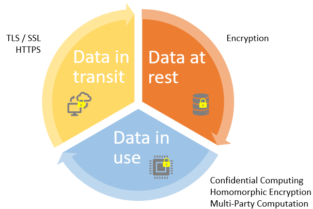
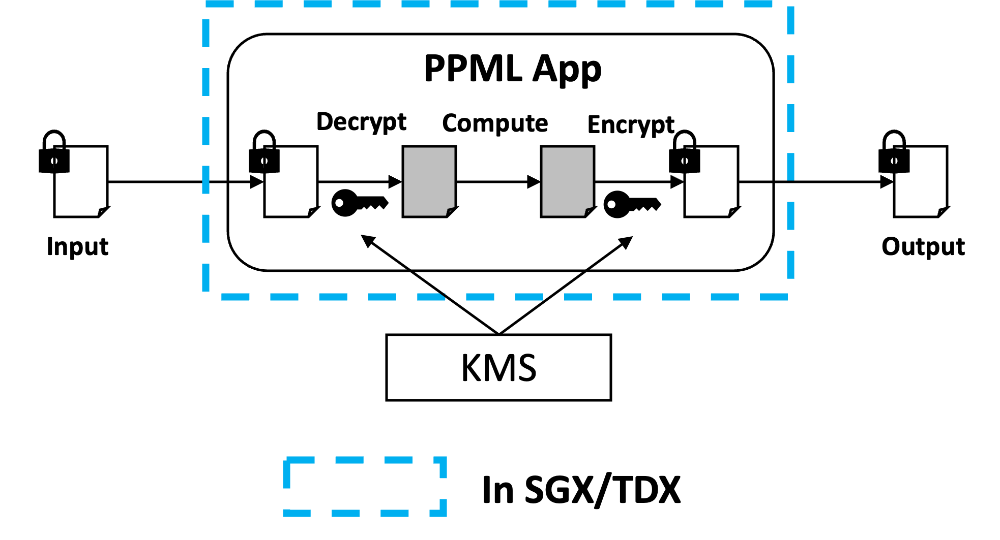

# 5-confidential-comp
Source: https://bigdl.readthedocs.io/en/latest/doc/PPML/Overview/intro.html

保护敏感数据，根据其生命周期分为三个阶段：

1. 数据存储：一般使用文件加密技术或者对存储驱动器本身进行加密
2. 数据（通过网络）传输：在传输之前进行加密、或者使用加密连接（例如 HTTPS、SSL、TLS、FTPS 等协议）来保护网络传输中的数据

3. 数据处理：三种方法，同态加密、安全多方计算、机密计算（confidential computing）

机密计算，是指在基于硬件的可信执行环境（Trusted Execution Environment, TEE）中执行计算来保护使用中的数据（data in use）的一种技术。

Intel SGX 是一种 TEE，基于硬件的内存加密，将特定应用代码和数据在内存在进行隔离

Intel TDX 是其“下一代” TEE，能够用于部署硬件上隔离的虚拟机（VMs）

Intel PPML 的端到端安全性保障是这样实现的：输入数据通过秘钥加密后使用安全连接传输，然后在 SGX/TDX 环境中解密，**解密后的明文进行计算**，计算结果加密后传回

* 可见如果对于模型推理任务而言，仍然是在明文状态下进行前向推理计算的，并没有额外保护

SGX 在 MPC 的角度下来看，可以视作对 client 的扩展，即 `client + TEE` 为一个合并的参与方，`server outside TEE` 是另一个参与方。
