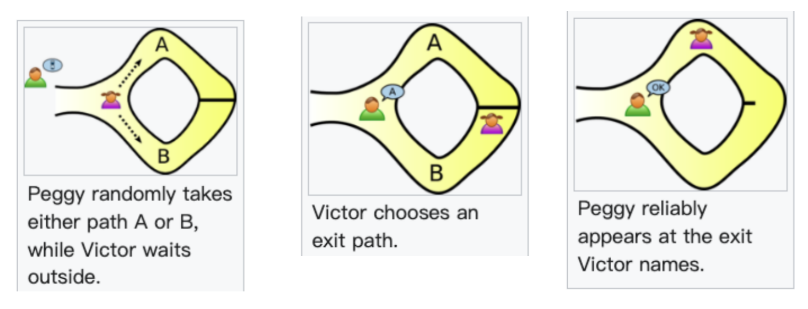

# 6-zkp
Source: https://en.wikipedia.org/wiki/Zero-knowledge_proof

Zero-knowledge proof 零知识证明，是一类密码学协议，其目标是：一方（证明者 prover）可以说服另一方（验证者 verifier）某个给定的陈述是真实的，而证明者无需向验证者传达该陈述真实性以外的任何信息

形式化地，一个 ZKP 需要满足三个性质：

* completeness：如果该陈述为真，那么诚实的验证者（即正确遵循协议）会被诚实的证明者说服
* soundness：如果该陈述为假，那么除了很小的概率外，没有任何作弊的证明者能够说服诚实的验证者它是真的
* zero-knowledge：如果该陈述为真，那么验证者除了知道其为真之外，不会知道任何其他信息。
  * 这个其实我没有完全理解，但是根据介绍，我觉得可以这样理解：**验证者不能凭借”验证过程“来说服第三方。如果仅凭过程就能够说服第三方，则不能叫做零知识的。**

wiki 里给了个很直观的例子，称为 Ali Baba cave

一个环形的山洞里有一个魔法门，prover 想要向 verifier 证明陈述”我知道打开魔法门的咒语“是真实的，但不透露咒语以及其他任何信息。则一个 ZKP 协议如下：

* 首先标定该环形山洞的左右两条路为 A 和 B
* prover 先走进山洞，随机选择一条路走进去
* verifier 后走进山洞，随机选择一条路让 prover 走出来

考虑 ZKP 的三个性质：

* completeness：如果 prover 知道咒语，则其一定每次都能正确地从 verifier 选择的路走出来，verifier 会被说服
* soundness：如果 prover 不知道咒语，则其只能在刚好 verifier 选择了和他选择同一个路的情况下正确地走出来，在重复 n 次之后，每次都刚好走对的概率只有 $1/2^n$ ，是一个非常小的概率
* zero-knowledge：verifier 无法知道开门的咒语；且 verifier 无法使用验证过程说服第三方，原因是，verifier 可以和 prover 事先勾结商量一个顺序，也可以达到一样的验证过程（每次 prover 都走对）

针对零知识这个性质，有两个变种的验证方式不满足：

* 其一是，verifier 走进山洞之后，抛硬币进行随机选择。这种方法虽然 verifier 无法知道开门的咒语，但是凭借这个验证过程是可以说服第三方的！因为第三方看到他确实是每次随机选择的路，无法与 prover 事先勾结。
* 其二是，verifier 和 prover 一同走进山洞，prover 直接从一条路进、另一条路出。这种验证方式显然满足 completeness 和 soundness，且 verifier 无法知道开门咒语。但同样的，凭借这个验证过程是可以说服第三方的！因为第三方看到 prover 从一条进另一条出，则其一定知道咒语。

