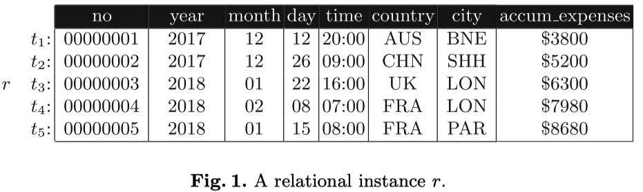

# 18-order-dependency
Source: Repairing Data Violations with Order Dependencies, 2018.

Order dependencies (ODs) 的直观理解：一个 OD "X orders Y" or `X -> Y`  表示：如果我们用 X 来对 tuples 排序，则 tuples 也会按照 Y 来排序，其中 X，Y 是attributes 的集合。以下面的表为例：

可以定义下面三种 ODs：

* `[no] -> [year, month, day, time]` 表示：当元组按 no 排序时，它们也会按 [year, month, day, time] 顺序排序（即随着时间的流逝，添加带有更大 no 的新记录）
  * 可见，OD 可用于查询优化。在满足这个 OD 的表上，以“按 [year, month, day, time] 排序”形式的查询可以很容易地重写为“按no排序”。当索引仅建立在no上时，这是有益的，并有助于减少索引空间。
* `[year, month, day, time] -> [accum_expenses]` 表示：按时间排序的也会按累计费用排序（即更晚时间的记录其累计费用显然应该也更大）
* `[city] -> [city, country]` 实际上是函数依赖性（FD）`city -> country`的一种 re-interpretation，即通过将 left-hand side（LHS）属性放在列表中的 right-hand side（RHS）上，任何FD都可以映射到等效的OD。

**结论：**

* 显然 OD 相较于 DC 表达性要弱很多，只是描述了两组 attributes 之间的单调排序关系。无法表达例如：员工工资不能高于其 supervisor 的工资这样的关系，除非员工和 supervisor 之间可以通过例如工号之类的 attributes 进行排序。限制多很多。
