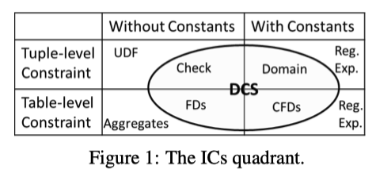

# 16-DC-discovery-first
Source: Discovering Denial Constraints, VLDB 2013

本文的 intro 里做了一个图来展示 DC 和不同类别的IC（Integrity constraints）之间的联系：

本文认为 DCs 在 expressiveness 和 complexity 之间实现很好的平衡：

1. DCs 定义在 predicates 上，很容易用 SQL 进行表达和一致性 checking
2. DCs 已经应用在很多数据清洗的场景，包括 data repairing, consistent query answering 和 expressing data currency rules
3. 虽然 DCs 的静态分析结果是不可判定的（undecidable），但本文表明，有可能为 DCs 开发出一套完善的推理规则和线性蕴涵测试算法，从而使 DCs 作为一种 IC language 得到有效采用

本文给出了 DCs discovery 问题的形式化定义：

​	给定一个 relational schema R 和其实例 I，DCs discovery 问题是找到在 I 上成立的全部 valid minimal DCs

Implication testing：指确定一组 DCs 在逻辑上是否意味着另一个 DC 的过程。简单地说，它是问一组现有DCs的真值是否保证了另一组DC的真值。例如，如果你有两组约束，你想知道第一组是否确保第二组也会成立。

DCs 的 implication testing 问题已经被证明是一个 coNP-complete 的：

* coNP：这是一个复杂度类别，包括可以在多项式时间内验证答案为“否”的问题。从本质上讲，如果你能证明某个条件不成立，你就能高效地做到这一点。
* Complete：如果一个问题是复杂度类别中最难的问题之一，那么它就被认为是复杂度类别中的**完整**问题。如果你能高效地解决一个 coNP-Complete 问题，那么你就能高效地解决 coNP 中的所有问题。

本文提出了一个 linear、sound 但是不 complete 的算法来进行 implication testing，用于降低在 discovery 算法输出里 DCs 的数量。

**结论**

DCs discovery 一般用在比较干净的数据上，如果本身带一定错误的话，应该考虑使用 approximate DCs；对于我们的场景，可能不太用得到自动化发现算法，直接手工制定规则进行 checking 即可。

如果要用 discovery 算法，需要先手工整理一些干净的数据集。
