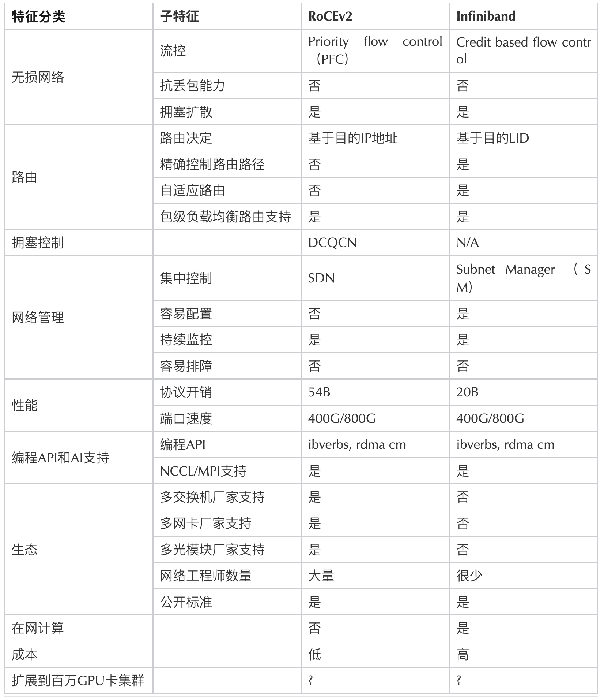
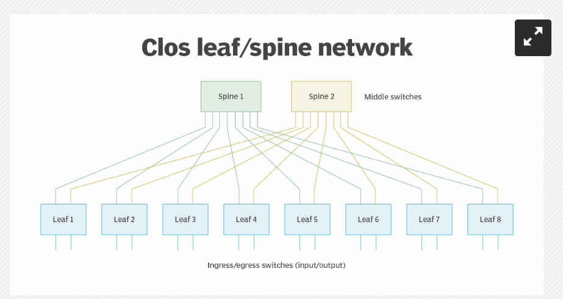

# NV-DC
> NVMe: Non-Volatile Memory express

是专门为 non-volatile memory 技术（例如 NAND flash 和 solid-state drives SSDs）设计的存储协议。

* 相较于旧协议（例如 SATA），NVMe 实现更快的数据传输率和更低的延迟
* NVMe 使用 PCIe 接口，能够直接在 CPU 和存储设备之间通信

> NVLink, NVLink Switch

NVLink 相较于传统的 PCIe 连接而言带宽更高，能支持 GPU-to-GPU 的直接通信

* https://zhuanlan.zhihu.com/p/654417967
* 在 NVLink 之前，NVIDIA 有一个 GPUDirect P2P 技术，是通过 PCIe 连接实现的 GPU-to-GPU 通信，无需 CPU 参与，无需将数据临时暂存主机内存
* 但是 PCIe 带宽仍然是不够的（PCIe3.0*16的双向带宽不足 32GB/s），因此 2016 年 NVIDIA 发布了新的 NVLink 架构，提供了高达 300GB/s 的双向带宽
  * https://www.nvidia.com/en-us/data-center/nvlink/ 根据官网，最新一代的 NVLink 提供 1800GB/s 的带宽

NVLink Switch 则是建立在 NVLink 的基础上的一个高速 switch chip，功能是在单个或多个 nodes 的多个 GPUs 上进行通信

* 每个 switch 有 18 个端口，采用 fully connected 拓扑，即允许任一端口与任一端口之间进行全速的通信，非常适合于 all-to-all 的 GPUs 通信

> RDMA

关于这个，比特智路的一个微信推文我感觉很清楚：

提供RDMA有两种主要方式，一种称为Infiniband (IB)，另一种是 RoCEv2 (RDMA over Converged Ethernet version 2)

IB 和 RoCEv2 的编程API相同，对广泛用于AI模型训练和推理的NCCL和MPI等高性能网络库的支持也是相同的。

NVIDIA 还有一个 GPUDirect RDMA 技术：https://docs.nvidia.com/cuda/gpudirect-rdma/

* 使用 PCIe 在 GPU 和第三方对等设备之间建立直接的数据交换路径。第三方设备包括：网络接口、视频采集设备、存储适配器。

> NCCL

NVIDIA Collective Communications Library，为多机多卡通信设计的，实现了一系列的 collective 通信 routines，包括 allreduce, broadcast, reduce, allgather, reducescatter, p2p send and receive

---

看了这些各种网络技术，我现在的一个问题是：**当前万卡集群的 best practice 网络设施是什么？**

字节和北大在 NSDI 24 的论文：MegaScale: Scaling Large Language Model Training to More Than 10,000 GPUs

* DC network 是基于 Broadcom Tomahawk 4 路由器搭建的，采用三层 CLOS-like 拓扑结构，连接 12288 GPUs；每层的路由器里 downlink 和 uplink 各 32 端口；

* 

* 根据 32/32 上下行的设计，在 CLOS 拓扑下，能够连接的 GPUs 数为 $32\times 32\times S$ 其中 S 是 spine switch 的个数，可见为了支持 12288 GPUs，spine switch 个数正好为 12 个

* 但是根据论文说是三层 switches，所以应该在 spine 层之上还有一个 super-spine 层，用于连接 spine switches；从连通性的角度来看 super-spine switch 是不必要的，因为两层架构下的最大可连接的 GPUs 数量是 32x32x32=32,768；这个系统里用到第三层的 switch 可能有其他考虑。

  * 根据 GPT4 的回复，使用 super-spine switch 可能有以下好处：

    * Scalability for future growth beyond 32,768 GPUs.

      Improved fault tolerance and redundancy.

      Better load balancing and congestion management.

      Simplified cabling and physical organization in large data centers.

      Support for oversubscription to reduce costs while maintaining acceptable performance.

      Integration with existing hierarchical network designs or administrative requirements.

>  大规模分布式训练中，采用默认的 DCQCN 协议，all-to-all 通信可能会导致拥塞和优先流控制（PFC）水平升高

由 DCQCN 和 PFC 可见，应该使用的是 RoCE RDMA 协议。

>  NCCL 中的参数可用于控制重传计时器和重试次数。我们对这些参数进行了调整，以便在链路中断时快速恢复。为了进一步缩短恢复时间，我们在网卡上启用了 adap_retrans 功能。

可见也用到了 NCCL 库进行 collective communication

* 文章中还提到了 NCCL 库的初始化阶段，在万卡平台上需要约 18 分钟。对于需要频繁地进行 routine test 和超参调整、debug 操作是无法忍受的。
* 文章做了两个优化：其一是将同步阶段的 barrier 操作使用的 TCPStore（单线程、阻塞） 改为 Redis（非阻塞、异步）；其二是重新设计了 global barriers 的使用，将其复杂度从 O(n^2) 降为 O(n)。最终将万卡上的初始化时间优化到小于 30s

这个文章还需要多花时间学一下，很多细节。
