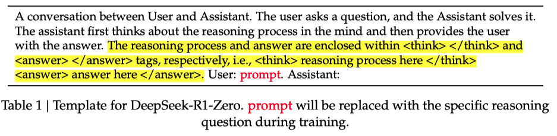

# DeepSeek-R1
> DeepSeek-R1: Incentivizing Reasoning Capability in LLMs via Reinforcement Learning

GRPO / Group Relative Policy Optimization 强化学习方法（也是 DeepSeek 团队，24年的工作）：

* 之前的一些基于 RL 来做 reasoning 的工作都需要 supervised 数据，而 deepseek-r1-zero 不需要任何监督数据，直接使用 RL 来实现 LLM reasoning 能力
* GRPO 方法里不需要 critic model，通过 group scores 来估计 baseline；PPO 方法里需要训练一个和策略模型尺寸相当的价值模型，会消耗大量计算资源，导致训练难以扩展。

$\pi_\theta(o_i|q)$ 的含义是：训练的 LLM 在给定输入 $q$ 的情况下，预测 next token 为 $o_i$ 的概率

策略比率 $\frac{\pi_\theta(o_i |q)}{\pi_{\theta_{old}}(o_i|q)}$ 的含义是：更新的 LLM 相较于旧的模型而言，在给定输入的情况下预测 next token 为 $o_i$ 的相对概率，如果该值大于1，则说明新模型对预测 $o_i$ 的偏好更高（概率增加），反之则说明模型认为该 token 的价值降低了。

优势值（Advantage Function $A_i$ ）的定义为：

$A_i = Q(q, o_i) - V(q) = \frac{r_i - mean(r_1, ..., r_G)}{std(r_1, ..., r_G)}$

其中：

- $Q(q, o_i)$ 在输入 q 下预测 $o_i$ 并遵循策略的预期总回报
- $V(q)$ 在输入 q 下的**基线价值**（即模型认为的平均回报）

优势值可以理解为：**在给定输入下，预测下一个 token 为 $o_i$ 相对于平均表现的好坏**：

- 如果 $A_i >0$ 则说明表现比平均水平好，否则说明表现比平均水平差

策略比率反映的是新策略与旧策略的相对概率，而优势值提供了关于这个预测动作的实际好坏的评价。将两者结合，目的是引导策略优化的方向，使得：

1. **动作更好的（优势值>0）**：
   - 如果新策略对该动作的概率更高，那么乘上优势值会增加目标函数的值，鼓励这种变化。
   - 如果新策略对该动作的概率降低了，目标函数的值会减少，阻止这种变化。
2. **动作更差的（优势值<0）**：
   - 如果新策略对该动作的概率更低，乘上负的优势值会增加目标函数的值，鼓励这种变化。
   - 如果新策略对该动作的概率反而增加了，目标函数的值会减少，惩罚这种变化。

策略比率描述的是策略模型对于预测动作的倾向性；而优势值则是描述该预测动作是否有利。将这两个部分结合在一起使得优化过程既能够利用优势值指导策略的改进，又能够通过策略比率限制新旧策略的变化幅度，确保训练的稳定性。直观上，**策略比率是方向盘，优势值是加速器或刹车**，两者共同决定了策略优化的方向和幅度。

在 reward 计算上，r1-zero 采用 rule-based 方案，包含两种：

1. accuracy：对于数学问题、编程问题这种具有确定答案的，可以计算回复的正确性。
2. format：强制要求模型将其思考过程放进 \<think\>  \</think\> 标签之间。

训练时的 prompt 模板：

挺有意思的，通过特殊的 tag token 来控制模型分别输出思考过程和最终答案。
