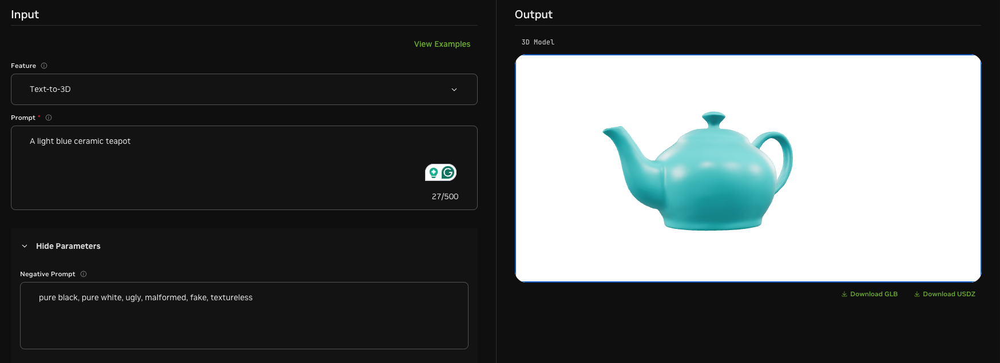
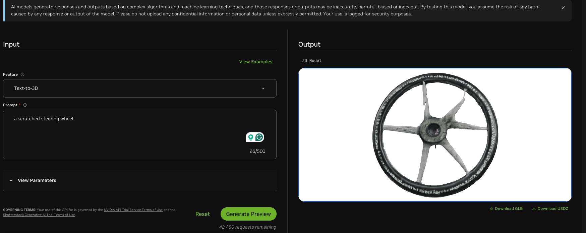

# NVIDIA-IoT
> nvidia blogs

对 NVIDIA 在 IoT 领域下的技术和应用调研


**NVIDIA Metropolis**

视觉分析（包括传统 CNNs 和最近的 VLMs）的一系列开发工具：


感觉实际上就是一整套工具链，从最开始的数据构建、模型训练，到推理部署。直接和这个 Metropolis 相关的应该就是 Metropolis Microservices 这个模块：

* 支持 NVIDIA Cloud 和 NVIDIA Jetson Orin 边缘 AI 平台部署
* 在 resilience 和 security 方面具有优势；且提供了许多可以作为开发 building blocks 的微服务，例如视频存储和管理、AI 模型推理 pipelines 等；以及一些 pre-built 的应用，比如多摄像头追踪、空间占用率分析、few-shot 产品识别等等。
* 主要的优势：快速开发、灵活性和可扩展性、安全性和弹性

总的来说应该是一个偏软工的针对视频分析应用的平台，属于增强 NVIDIA GPU 开发生态的产品。

> 思考：类似的，我们能否为 research community 提供一些 building blocks？比如 pre-built 视频帧过滤器，可以选择使用不同的 backends（low-level feature + threshold，object detector + labels）。


**NVIDIA Omniverse**

集成各种 3D 模型相关工具的平台，可以用于构建数字孪生模型和仿真模拟器平台，主要面向工业制造和机器人的用例。

能够和一些生成式 AI 相结合，基于 3D 模板直接生成定制化的渲染结果：

https://build.nvidia.com/nvidia/conditioning-for-precise-visual-generative-ai

![FireShot Capture 006 - 3D Conditioning for Precise Visual Generative AI Blueprint by NVIDI_ - [build.nvidia.com]](FireShot Capture 006 - 3D Conditioning for Precise Visual Generative AI Blueprint by NVIDI_ - [build.nvidia.com].png)

Text-to-3d 的模型（prompt 是自己填的，生成速度和质量感觉都还可以）：



> 对于物联网研究，如果我们可以构建一些物联网场景的数字孪生模型，例如居家看护、工业制造，再结合生成式模型自主地进行泛化，可以为相关研究提供一个虚拟测试环境。

Omniverse 的用途官网上给了五大类：

1. synthetic data generation：合成数据生成流程包括：构建数字孪生、对场景进行随机化、模拟环境、生成丰富图像、训练&验证模型。构建数字孪生也可以利用生成式模型。其中还提到了一种场景是工业生产缺陷检测。由于现实世界里的缺陷数据非常稀缺，可以通过生成式的形式构建有缺陷的3D产品模型。例如下面是用 prompt "a scratched steering wheel" 生成的 3D 模型：

   通过修改 prompt 可以批量构建各种形式的缺陷产品模型，基于此训练缺陷检测模型可以提高泛化性，整体流程也更具可扩展性。

2. autonomous vehicle simulation：提到一个 high-fidelity sensor simulation 的概念，在 NV 的 sensor simulation 的介绍中，**提到 Omniverse Cloud Sensor RTX 提供了对 camera、lidar、radar 的高保真模拟器。**这一点感觉对于物联网研究还是很相关的，首先就是对于大规模 video analytics 的研究，camera sensor 的模拟是很成熟的。如果可以构建一个仿真的测试平台，对于优化 video analytics 效率会很有帮助。

3. Configurator development：基于 VR 的交互式产品定制，比较典型的 vr 应用。

4. reinforcement learning：在虚拟环境中训练强化学习算法，例如机器人控制，这个也比较典型。

5. Virtual facility integration：虚拟设施指的是在虚拟环境里对工厂、仓库、数据中心等设施进行设计、模拟、运行、优化等等。还是数字孪生的概念。可以预先模拟优化工厂布局。但看 nv 里的 demo 感觉还是一个概念阶段，多数都是 3d 动画展示一下。不清楚有没有真实价值。


**Isaac**

针对机器人场景的全栈开发库和 AI 模型，包括：

* ROS：基于开源 ROS 2 开发的、使用 CUDA 加速后的操作系统
* Manipulator：AI-赋能的机械臂
* Perceptor：自动移动机器人（AMRs）
* GROOT：人形机器人（可以基于人进行的远程操作进行数据收集和模型训练）

> 如果做具身智能的研究，可以考虑用 NV Isaac 这个生态。大致思路都是做平台，做一些 building blocks，而非做具体应用和解决方案。


**NIM**

NV 部署了一系列的模型，提供了部署 dockers 和推理 API，能够加速开发过程。


**Video Analytics AI Agent**

使用 vision language models 来做视频分析，相较于传统的 fixed-function 模型，VLM 做视频分析的优势在于可以使用更少的模型来构建应用程序，这些模型具有极其复杂和广泛的感知能力以及丰富的上下文理解能力。但是显然开销上也会更大。

赋能的应用主要是视频搜索和总结，以及异常事件报警。

根据博客 https://developer.nvidia.com/blog/build-a-video-search-and-summarization-agent-with-nvidia-ai-blueprint/ 的描述：

```
目前，大多数 VLM 仅接受有限数量的帧，例如 8/10/100。它们也无法为较长的视频准确生成描述。对于较长的视频（例如长达一小时的视频），采样帧之间的间隔可能为 10 秒甚至更长。这可能会导致某些细节被遗漏或动作无法被识别。

解决此问题的方法是从长视频中创建较小的块，使用 VLM 单独分析这些块以生成密集描述，然后汇总和聚合结果以生成整个文件的单个摘要。提取过程的这一部分是 VLM 管道和 CA-RAG 模块。 

这种分块和描述策略也可以应用于直播。蓝图包括一个从 RTSP 服务器接收流数据的流管道。NVIDIA AI 蓝图根据用户配置的块持续时间不断生成视频块片段。然后，VLM 管道为这些块生成描述。

NVIDIA AI 蓝图不断从 VLM 管道收集字幕。当根据用户配置的摘要持续时间处理了足够多的块时，收集到的块将发送到 CA-RAG 进行汇总和聚合。蓝图继续处理下一个块。摘要使用 HTTP 服务器发送的事件流式传输到客户端。
```

可见，其处理长视频的策略仍比较粗暴，通过固定分块（图像）来生成局部描述之后，再整合局部描述（文本）生成最后的总结（文本）。

比较有意思的是他们用了 Graph-RAG 模块：为了捕获 VLM 生成的复杂信息，在视频采集期间构建并存储知识图谱。使用 LLM 将密集描述转换为一组节点、边和相关属性。此知识图谱存储在图形数据库中。通过使用 Graph-RAG 技术，LLM 可以访问此信息以提取摘要、问答和警报的关键见解，并超越 VLM 本身的能力。

* 有点像以前的 scene graph 的概念，只不过这里的转换操作可以直接交给 LLMs 来完成


**AI Blueprint**

英伟达蓝图是针对 agent 和生成式人工智能用例的参考工作流，开发者可以利用蓝图构建和运行定制的人工智能应用。也是生态型的工作，提供一些参考的 building blocks 给开发者。


调研过程中看到的其他公司的相关产品：

Azure IoT

Apple On-Device Face Detection: https://machinelearning.apple.com/research/face-detection

* 从最早的使用 Viola-Jones detection 算法，到使用卷积模型进行人脸识别，需要解决：
  * 神经网络架构设计：最后采用了一种图像分块+每块内进行2分类+如果监测到有人脸再运行回归预测 bounding box
    * 采用多种 scale 的组合架构，不同图像 scales 上运行相同的神经网络
  * 内存优化：蒸馏方法，训练较窄但深（thin-and-deep）的 student 模型
  * pipeline 优化：多模型共享参数、中间表达；控制任务粒度，避免影响手机上其他应用（例如 UI 动画）

> 思考：可以看到，即使对于一个我们认为很简单的人脸识别模型的落地应用，都需要考虑非常多的系统优化问题。涉及很多的技术栈，从 AI 算法（架构设计、训练、压缩）到 GPU 级的底层编程（任务粒度控制）。
>
> 我的感觉是，相较于公司更注重工程实现，作为高校的系统研究组，我们也需要掌握一定的全栈开发能力，不然很多问题根本意识不到。同时，还需要具备算法创新能力和理论分析能力。
>
> 我觉得比较理想的一种研究路径是：从实际的、但high-level的需求出发，基于理论分析，设计创新算法，然后着手系统实现，在过程中发现、解决 low-level的技术点，最终形成（1）一个创新算法（2）一套可用系统。这样，对于创新算法而言，这个系统能够更真实、充分地对其进行验证；而对于这个系统而言，因为该创新算法的存在，使得其价值不仅是贡献一个重复制造的轮子，而是可以作为未来研究、工程的 building blocks。这种例子包括，vLLM，mLLM 这些 LLM 推理框架；以及像 yolo、openpose 这种把模型部署工程化的工作。
