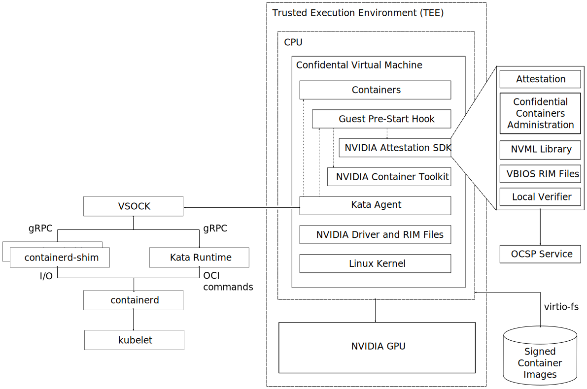

# Confidential Containers

confidential containers 是 NVIDIA 和 Intel 开发的一个开源项目，旨在以容器形式提供在各类 TEE 硬件上通用的机密计算环境。基于这个项目，我希望实现如下架构的功能：

即在支持 TEE 的 CPU 硬件（例如 Intel SGX/TDX，AMD SEV）上，将 NVIDIA GPU 接入到同一个容器里，实现利用「受信任的 CPU」和「不受信任的 GPU」一起运行 SCX 程序。

根据 https://docs.nvidia.com/datacenter/cloud-native/gpu-operator/24.9.2/gpu-operator-confidential-containers.html，NV H100 系列 GPUs 可以接入 confidential containers：

这个实际上还是依赖特定 GPU 硬件，所以不是我们需要的。我们不需要 GPU 支持 CC。

根据文档 https://docs.nvidia.com/datacenter/cloud-native/gpu-operator/24.9.2/platform-support.html#supported-nvidia-data-center-gpus-and-systems，实际上几乎全类型的 NV GPUs 都支持 operator，都可以接入 k8s 管理的容器中。

